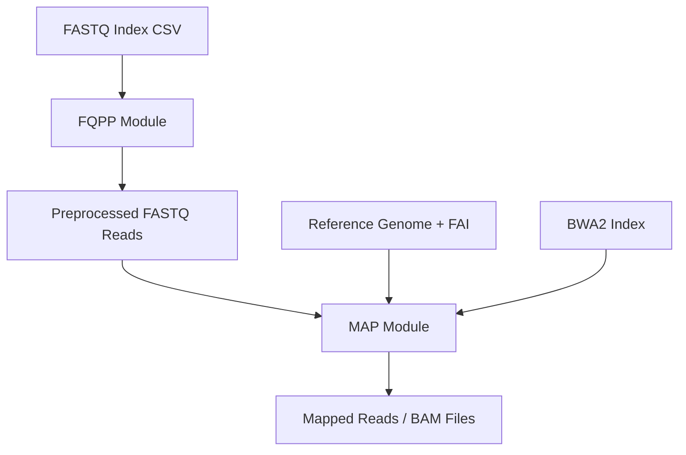

# 🧬 FASTQ to Reference Genome Mapping Pipeline

This Nextflow pipeline efficiently maps paired-end FASTQ files to a reference genome. It's part of the [dmp-stack]() ecosystem.

## 📂 Input Files

You need the following input files to run the pipeline:

### 🗂 `index.csv`

A CSV file with columns:

| info | lane | read1 | read2 |
| ---- | ---- | ----- | ----- |

- `info` must contain colon-separated key-value pairs, only mandatory (and used) one now is `id`! (e.g. `id=XYZ:group=case`)
- `lane` they are not used in the analysis atm, feel free to arbitrarily fill up if not available.
- `read1`, `read2` are paths to the paired-end FASTQ files.

Example:

```csv
info,lane,read1,read2
id=XYZ:group=case,L1,sample1_L1_R1.fastq.gz,sample1_L1_R2.fastq.gz
```

### 🧬 Reference Genome Files

- `genome.fa`: The whole-genome reference genome FASTA file (e.g. available through [iGenomes](https://emea.support.illumina.com/sequencing/sequencing_software/igenome.html)).
- `genome.fa.fai`: The corresponding `.fai` index file.
- `BWA2 index`: (⌥ !OPTIONAL) A directory with BWA2 index files (`.bwt.2bit.64`, `.pac`, etc.)

---

## ⚙️ Parameters

These are specified either via the `nextflow.config`, a `.env` file, or passed directly on the command line:

| Parameter     | Description                          |
| ------------- | ------------------------------------ |
| `--index`     | CSV index file with FASTQ file paths |
| `--genome`    | Path to reference genome FASTA       |
| `--fai`       | Path to the FASTA index (.fai)       |
| `--bwa2index` | Path to the BWA2 index directory     |

---

## 🧪 Example Command

```bash
nextflow run main.nf \
    --index index.csv \
    --genome /path/to/genome.fa \
    --fai /path/to/genome.fa.fai \
    -resume \
    -profile slurm,hpc,conda,tower \
    -w /path/to/scratch
```

---

## 🧰 Workflow Overview



---

## 🧼 Output

<WIP>

---

## 📦 Dependencies

- [Nextflow](https://www.nextflow.io/)
- A conda environment or container setup if using `-profile conda`
