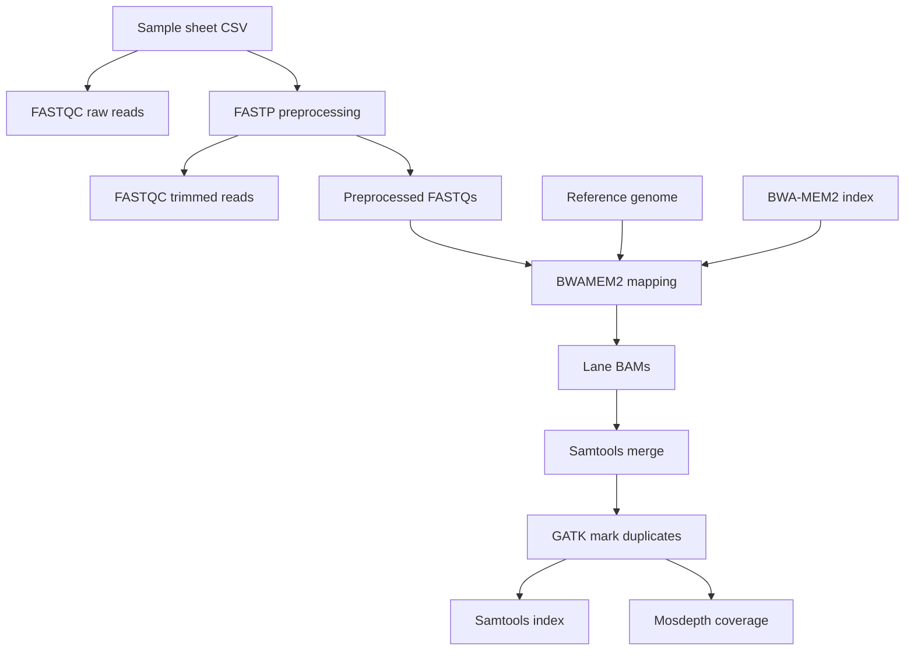

# 🧬 DMP Mapping Pipeline

Nextflow pipeline for paired-end read preprocessing and reference mapping. It is built around nf-core modules and runs in two stages:

1. FASTQ preprocessing with `FASTQC` and `FASTP`
2. Mapping and post-processing with `BWAMEM2`, `SAMTOOLS`, `GATK4_MARKDUPLICATES`, and `MOSDEPTH`

## Overview

The workflow reads a CSV sample sheet, preprocesses the FASTQs, maps reads to a reference genome, merges lanes per sample, marks duplicates, indexes the final BAM, and generates coverage summaries.

## Input files

### `index.csv`

CSV file with the columns below:

| info | lane | read1 | read2 |
| ---- | ---- | ----- | ----- |

- `info` contains colon-separated key-value pairs.
- `id` is the only mandatory key used by the pipeline.
- `lane` is used to keep per-lane metadata and read-group information.
- `read1` and `read2` point to the paired FASTQ files.

Example:

```csv
info,lane,read1,read2
id=XYZ:group=case,L1,sample1_L1_R1.fastq.gz,sample1_L1_R2.fastq.gz
```

### Reference genome

- `genome.fa`: reference genome FASTA
- `genome.fa.fai`: matching FASTA index
- `bwa2index`: optional precomputed BWA-MEM2 index directory

## Parameters

These parameters are defined in `main.nf` and can also be set in `nextflow.config`, a `.env` file, or on the command line:

| Parameter | Description |
| --- | --- |
| `--fqindex` | CSV file with FASTQ paths and metadata |
| `--genome` | Path to the reference genome FASTA |
| `--fai` | Path to the FASTA index file |
| `--bwa2index` | Optional path to an existing BWA-MEM2 index directory |
| `--outdir` | Output directory for published results |

If `--bwa2index` is not provided, the pipeline builds the index from `--genome`.

## Example run

```bash
nextflow run main.nf \
  --fqindex index.csv \
  --genome /path/to/genome.fa \
  --fai /path/to/genome.fa.fai \
  --outdir results \
  -resume \
  -profile slurm,hpc,conda,tower \
  -w /path/to/scratch
```

For local testing, the repository includes a `Justfile` target that runs the pipeline with the bundled test data:

```bash
just test-run
```

## Workflow



## Output

Published outputs are written under `--outdir` with the following structure:

- `preprocessing/fastqc_raw/<sample>/`
- `preprocessing/fastp/<sample>/`
- `preprocessing/fastqc_trimmed/<sample>/`
- `mapping/gatk4/<sample>/`
- `mapping/mosdepth/<sample>/`

Typical files include:

- FASTP JSON, HTML, and trimmed FASTQs
- FASTQC reports for raw and trimmed reads
- Marked-duplicate BAM/CRAM outputs and BAM indexes
- Duplicate metrics
- Mosdepth coverage summaries and distribution files

## Dependencies

- Nextflow
- A working execution backend such as local, SLURM, or HPC
- Conda, Micromamba, Singularity, or another supported profile depending on how the pipeline is run

## Notes

- The project uses nf-core modules stored under `modules/nf-core`, but those files are managed automatically and should not be edited directly.
- The top-level entrypoint is `main.nf`.
